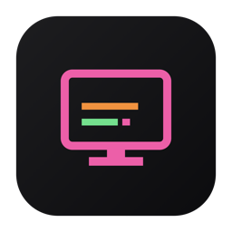

<div align="center">



# OpenCrashCart

**A native macOS client for USB crash-cart adapters — open, clean-room, bring-your-own-firmware.**

[](https://github.com/adamson34/open-crash-cart/actions/workflows/ci.yml)
[](https://github.com/adamson34/open-crash-cart/releases)
[](LICENSE)


</div>

OpenCrashCart ("OCC") gives you a headless machine's **screen, keyboard, and mouse** over a
USB crash-cart adapter — an open replacement for vendor software that only ships as Intel
binaries. It also supports generic **USB-Video (UVC) capture dongles** (HDMI/VGA→USB), with
full keyboard/mouse via their CH9329 serial-HID controller.

## Screenshots

_Coming soon._

## Features

- 🖥️ **Live KVM** — video, keyboard, and mouse to a headless target
- 💿 **Virtual media** — mount an ISO/IMG as a USB drive on the target (boot / install / recover)
- 📋 **OCR copy-from-screen** — select text on the remote screen, copy it to your Mac clipboard
- 📋 **Paste / type text** into the target
- ⌨️ **On-screen keyboard** with sticky modifiers (incl. the Windows key)
- 🎛️ **Auto-tune & manual video tuning**, **DDC/EDID presets**, **relative-mouse mode**
- 🪄 **Client-side image enhancement** — brightness / contrast / sharpen / grayscale to make fuzzy
  analog text readable (display-only; pairs with OCR)
- 🎥 **Session recording** to H.264, snapshots, themed UI, full menu bar
- 🔌 **Multi-adapter** — StarTech / Digital Multitools crash carts *and* generic UVC dongles,
  selected by user-editable hardware profiles

## Design

- **Pure Swift + AppKit**, arm64-native. USB via libusb (bundled in the app); UVC via AVFoundation.
- **Multi-adapter** by design: every device is a backend behind the `CrashCartAdapter` protocol.
- **Bring your own firmware.** Crash-cart adapters are FPGA devices needing a vendor bitstream
  each session. OpenCrashCart ships **none** of it — you point it at firmware you already own
  (Settings → Import Firmware). The app contains no vendor code or firmware and is clean-room
  throughout.

## Install

Grab the latest build from [Releases](https://github.com/adamson34/open-crash-cart/releases),
unzip, and move **OpenCrashCart.app** to /Applications. It's ad-hoc signed (not notarized), so
on first launch either right-click → **Open**, or:

```sh
xattr -dr com.apple.quarantine /Applications/OpenCrashCart.app
```

## Build

Requires the Swift toolchain and Homebrew `libusb`.

```sh
brew install libusb
swift build                 # builds OCCKit + the CLIs
./scripts/make-app.sh       # builds dist/OpenCrashCart.app (self-contained, code-signed)
```

Diagnostics: `swift run occ-probe` (detect adapters), `swift run occ-connect` (headless
boot/handshake).

## Testing

```sh
swift run occ-tests
```

A dependency-free test suite (the CLT toolchain ships no XCTest/swift-testing) covering the
video codec + keyframe-recovery, VSP + CH9329 protocol packing, HID keymap/typing, hardware
profiles + the device-matching registry, firmware-search resolution, USB error mapping, virtual-
media block math, and gzip inflate. Runs in CI on every push / PR to `main` and `dev`.

Code coverage over the OCCKit core:

```sh
./scripts/coverage.sh        # llvm-cov report (also surfaced in each CI run's summary)
```

The pure logic (codec, wire protocols, HID mapping, profiles, firmware resolution) sits near
100%; hardware-I/O paths (USB transport, UVC capture) need real devices and are validated on
hardware rather than in unit tests.

## Firmware

OpenCrashCart loads an adapter's FPGA bitstream from, in order: a profile's `firmwareDir`,
`OCC_FIRMWARE_DIR`, the folder set in Settings, OpenCrashCart's own
`~/Library/Application Support/OpenCrashCart/firmware`, then a vendor install as a fallback.
Use **Settings → Import Firmware…** to copy your firmware into OpenCrashCart's own folder;
after that the vendor app is no longer needed.

## License

[MIT](LICENSE). Clean-room and independent — no vendor code or firmware is included.
Product names are used only for descriptive interoperability.
